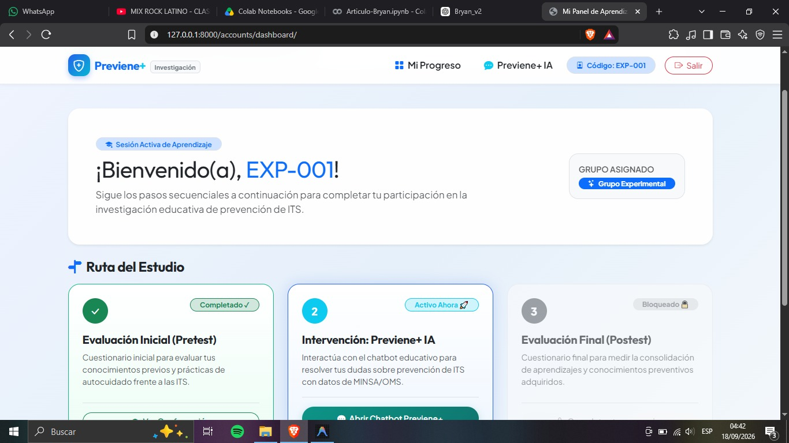
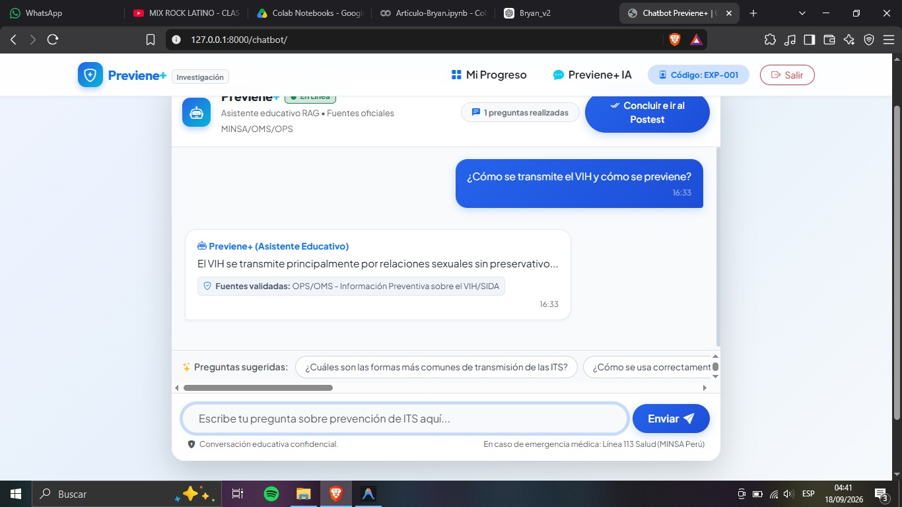
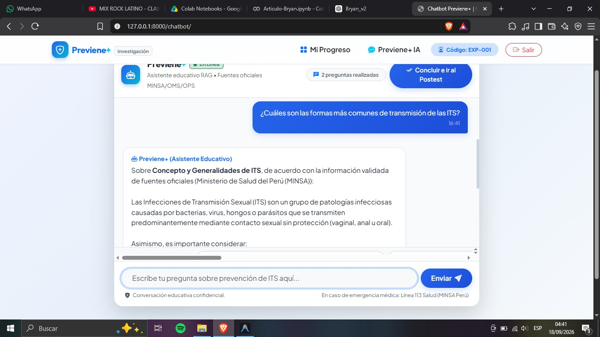
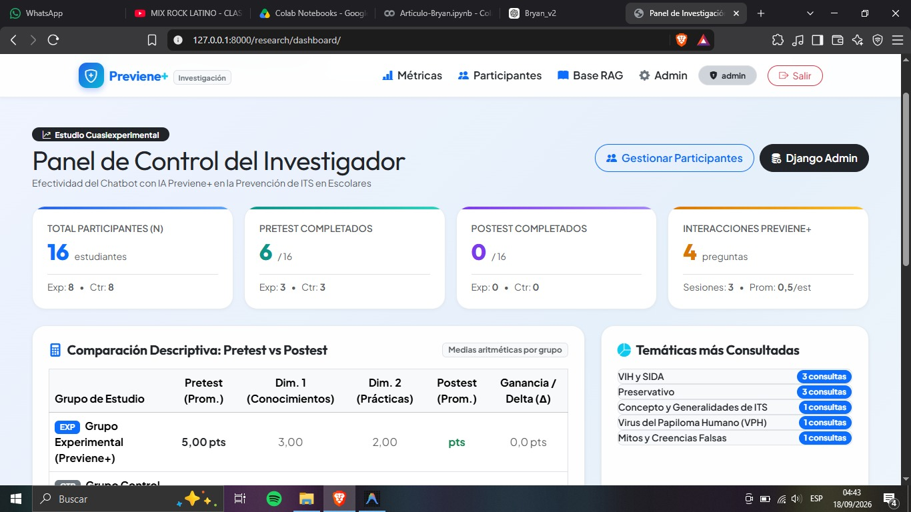
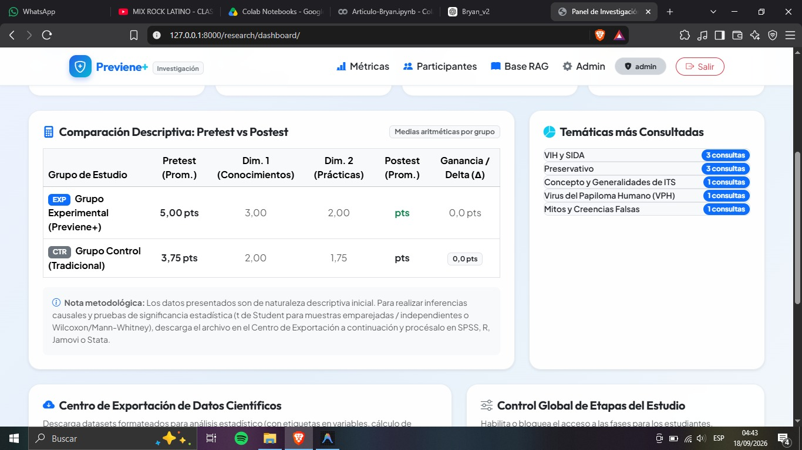
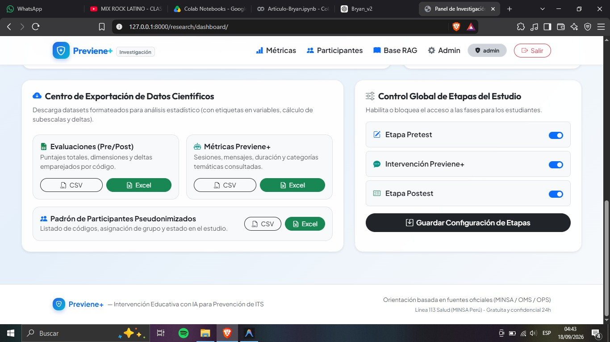

# Previene+ (Chatbot Educativo con IA para Investigación Cuasiexperimental en Prevención de ITS)

**Previene+** es una plataforma web modular desarrollada en **Python y Django 5.2 LTS** con base de datos **SQLite**, diseñada como instrumento de intervención educativa e investigación cuasiexperimental sobre la prevención de Infecciones de Transmisión Sexual (ITS) en escolares y jóvenes.

---

## 1. Esquema Metodológico del Estudio

La aplicación implementa el diseño cuasiexperimental con dos ramas de participantes:

```
GRUPO EXPERIMENTAL
Login (Código) ──> Asentimiento ──> Pretest ──> Intervención (Previene+ IA) ──> Postest ──> Finalización

GRUPO CONTROL
Login (Código) ──> Asentimiento ──> Pretest ──> Intervención Tradicional (Aula) ──> Postest ──> Finalización
```

* **Control de Acceso y Candados:** El chatbot Previene+ está habilitado exclusivamente para el Grupo Experimental una vez completado el Pretest.
* **Inmutabilidad de Respuestas:** Tras el envío del Pretest o Postest, el sistema bloquea cualquier modificación posterior.
* **Minimización de Datos:** No se recopilan nombres, apellidos, teléfonos ni correos de los estudiantes; se utilizan códigos pseudonimizados (ej. `EXP-001`, `CTR-001`).

---

## 2. Capturas de Pantalla del Sistema

### 2.1. Panel del Estudiante y Roadmap de Aprendizaje
Visualización clara y secuencial de las etapas del estudio (*Asentimiento*, *Pretest*, *Intervención* y *Postest*):



---

### 2.2. Interfaz del Chatbot Educativo Previene+ (IA con RAG)
Interacción educativa basada en fuentes validadas (MINSA / OMS / OPS), preguntas frecuentes y sugerencias rápidas:

| Conversación Inicial | Respuestas con Fuentes Validadas |
| :---: | :---: |
|  |  |

---

### 2.3. Panel del Investigador y Métricas Cuasiexperimentales
Métricas en tiempo real, matriz estadística descriptiva (Pretest vs Postest, subescalas por dimensiones y deltas) y centro de exportación científica:

#### Indicadores Globales y Métricas de Participación


#### Matriz Estadística Comparativa (Pretest vs Postest y Cálculo de Ganancia $\Delta$)


#### Centro de Exportación (CSV / XLSX) y Control de Etapas


---

## 3. Tecnologías Principales

* **Backend:** Python 3.12, Django 5.2 LTS.
* **Base de Datos:** SQLite (robusta, portable y lista para pruebas inmediatas).
* **Frontend:** Django Templates + Bootstrap 5 + CSS Custom Design Tokens + HTMX para interacción dinámica sin necesidad de React.
* **Inteligencia Artificial y RAG:** Integración desacoplada con OpenAI API (`OPENAI_MODEL=gpt-5.6-luna` o configurable en `.env`) y motor de recuperación léxico-semántica sobre fragmentos validados de fuentes oficiales (**MINSA Perú, OMS, OPS**).
* **Exportación Estadística:** Módulo de exportación directa a **CSV y Excel (XLSX)** con cálculo de subescalas por dimensiones y deltas ($\Delta = \text{Postest} - \text{Pretest}$), optimizado para **SPSS, R, Jamovi y Python**.

---

## 4. Estructura del Proyecto

```
Previene+/
├── core/                       # Configuración Django (settings, urls, wsgi, asgi)
├── accounts/                   # Autenticación pseudonimizada, roles y asentimiento informado
├── evaluations/                # Evaluaciones multidimensionales (Pretest y Postest)
├── knowledge/                  # Base documental validada (MINSA/OMS/OPS) y chunks RAG
├── chatbot/                    # Asistente Previene+ IA, sesiones, mensajes y servicio RAG
│   └── services/
│       ├── ai_service.py       # Pipeline desacoplado de OpenAI y prompt de seguridad
│       └── rag_retriever.py    # Motor de recuperación de fragmentos relevantes
├── research/                   # Métricas estadísticas, control de etapas y exportación CSV/XLSX
│   └── management/commands/
│       └── seed_data.py        # Carga de datos de demostración, preguntas e instrumentos
├── templates/                  # Vistas HTML responsivas para móvil y escritorio
├── static/                     # Archivos CSS y JavaScript (previene.css, previene.js)
├── staticfiles/                # Archivos estáticos recolectados para producción
├── .env.example                # Plantilla de variables de entorno
├── requirements.txt            # Dependencias del proyecto
├── Procfile                    # Despliegue en Render / Railway
└── manage.py
```

---

## 5. Guía de Instalación y Ejecución Local (Windows / PowerShell)

### Paso 1: Clonar o situarse en el directorio del proyecto
```powershell
cd c:\Users\JhosepSF\Downloads\Previene+
```

### Paso 2: Crear y activar el entorno virtual (opcional pero recomendado)
```powershell
python -m venv venv
.\venv\Scripts\Activate.ps1
```

### Paso 3: Instalar las dependencias
```powershell
pip install -r requirements.txt
```

### Paso 4: Configurar las variables de entorno
Copia el archivo `.env.example` como `.env`:
```powershell
Copy-Item .env.example .env
```
*(Opcional: Si cuentas con una clave de OpenAI, colócala en `OPENAI_API_KEY`. Si no, el sistema funcionará automáticamente en modo simulación científica offline con los fragmentos de MINSA/OMS).*

### Paso 5: Ejecutar las migraciones
```powershell
python manage.py migrate
```

### Paso 6: Cargar datos de demostración, preguntas y base MINSA/OMS
```powershell
python manage.py seed_data
```

### Paso 7: Iniciar el servidor de desarrollo
```powershell
python manage.py runserver
```
Accede en tu navegador a: **`http://127.0.0.1:8000/`**

---

## 6. Cuentas y Códigos de Demostración

| Rol | Identificador / Código | Contraseña | Descripción |
| :--- | :--- | :--- | :--- |
| **Administrador / Investigador** | `admin` | `admin123` | Acceso a panel de métricas, participantes, base RAG y Django Admin |
| **Estudiante Experimental 1** | `EXP-001` | *(Sin clave)* | Grupo Experimental (Acceso a Pretest y Chatbot Previene+) |
| **Estudiante Experimental 2** | `EXP-002` | *(Sin clave)* | Grupo Experimental |
| **Estudiante Control 1** | `CTR-001` | *(Sin clave)* | Grupo Control (Acceso a Pretest y Postest tradicional) |
| **Estudiante Control 2** | `CTR-002` | *(Sin clave)* | Grupo Control |

---

## 7. Módulos y Funcionalidades Principales

### 7.1. Motor de Evaluaciones (`evaluations`)
* **Dimensión 1:** *Conocimientos sobre prevención de infecciones de transmisión sexual.*
* **Dimensión 2:** *Prácticas preventivas frente a infecciones de transmisión sexual.*
* Preguntas con tipos de opción múltiple, verdadero/falso y escala Likert con ponderaciones automáticas.

### 7.2. Chatbot Previene+ e IA Segura (`chatbot`)
* **Prompt Seguro Versionado (`v1.0-research-safe`):**
  * Tono empático, no moralizante, no estigmatizante y adecuado para adolescentes.
  * No realiza diagnósticos médicos ni prescripciones; ante signos de alarma o dudas deriva a la **Línea 113 Salud del MINSA (opción 3)**.
  * Ante situaciones de violencia o coerción, deriva a la **Línea 100 / CEM** y adultos de confianza.
  * Respuestas condicionadas al contexto recuperado de la base de conocimiento oficial.
* **Registro de Reproducibilidad Científica (`InterventionConfigLog`):**
  * Almacena inmutablemente la versión del modelo, versión del prompt, versión de la base y fecha/hora exacta de cada intervención.

### 7.3. Panel de Investigación y Exportación (`research`)
* Visualización en tiempo real de $N$, participantes por grupo, tasas de finalización, medias por dimensión y deltas de ganancia.
* Generador de códigos en lote para nuevos participantes (ej. `EXP-010...EXP-050`).
* Descarga de archivos estructurados en `.csv` y `.xlsx`:
  1. `previene_participantes.csv`
  2. `previene_evaluaciones.csv` / `.xlsx` (ideal para pruebas t de Student o Wilcoxon).
  3. `previene_uso_chatbot.csv` / `.xlsx` (frecuencia, duración y temáticas consultadas).

---

## 8. Ejecución de Pruebas Automatizadas

Para validar todos los módulos, permisos de grupo, RAG y exportación:
```powershell
python manage.py test
```

---

## 9. Despliegue en Producción (Render / Railway)

1. El repositorio incluye `Procfile` y `runtime.txt`.
2. Las variables de entorno recomendadas para producción son:
   * `SECRET_KEY`: Tu clave secreta de Django.
   * `DEBUG`: `False`
   * `ALLOWED_HOSTS`: Tu dominio (ej. `.onrender.com, .railway.app`).
   * `OPENAI_API_KEY`: Tu API Key de OpenAI.
   * `OPENAI_MODEL`: `gpt-5.6-luna` (o `gpt-4o-mini`).
3. El comando de inicio preconfigurado es: `gunicorn core.wsgi:application`.
